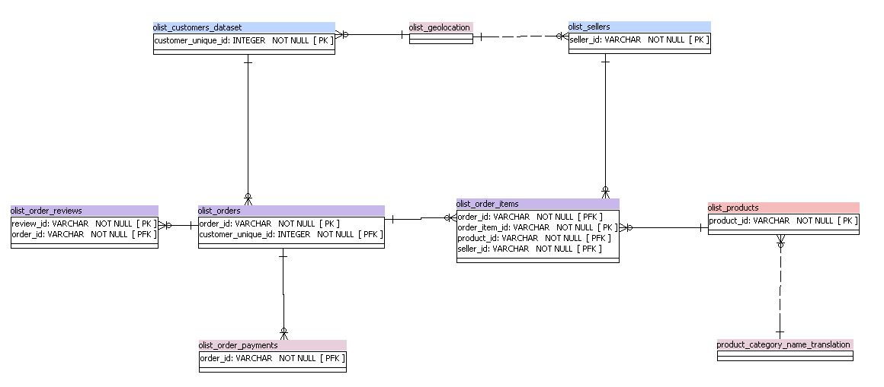

# Segmentez des clients d'un site e-commerce

Projet 5 [_Segmentez des clients d'un site e-commerce_](https://openclassrooms.com/fr/paths/188/projects/630/assignment)
sur [_OpenClassrooms_](https://www.openclassrooms.com).

## 📗 Context
Olist souhaite que vous fournissiez à ses équipes d'e-commerce une segmentation des clients qu’elles pourront utiliser au quotidien pour leurs campagnes de communication.
Votre objectif est de comprendre les différents types d’utilisateurs grâce à leur comportement et à leurs données personnelles.
Vous devrez fournir à l’équipe marketing une description actionable de votre segmentation et de sa logique sous-jacente pour une utilisation optimale, ainsi qu’une proposition de contrat de maintenance basée sur une analyse de la stabilité des segments au cours du temps.

## 🎯 Objectif
Analyse exploratoire
Apprentissage non supervisé
Construire un modèle de scoring
## 💻 Technologies
- Pandas
- Numpy
- Matplotlib
- Seaborn
- Scipy
- Sklearn (PCA, GridSearchCV, KMeans)

## 📄 Dataset
[_olist_](https://s3-eu-west-1.amazonaws.com/static.oc-static.com/prod/courses/files/Parcours_data_scientist/Projet+-+Impl%C3%A9menter+un+mod%C3%A8le+de+scoring/Projet+Mise+en+prod+-+home-credit-default-risk.zip)

## 📈 Compétences évaluées

###  🎓  Compétences : <i>Transformer les variables pertinentes d'un modèle d'apprentissage non supervisé

###  🎓  Compétences : <i> Mettre en place le modèle d'apprentissage non supervisé adapté au problème métier

###  🎓  Compétences : <i> Adapter les hyperparamètres d'un algorithme non supervisé afin de l'améliorer

###  🎓 Évaluer les performances d’un modèle d'apprentissage non supervisé
 

